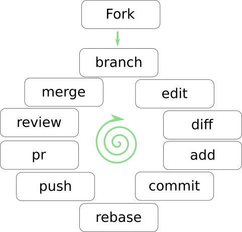

# Open Source methods training

Hello,

I crafted this little training for people new to open source methods and
tools. This was part of "Open Source Day" at a customer I work with, but
seems handy as a workshop of it's own. This allows you to practice how your
teams could utilize open source management of code, configs or docs, using
the typical methods based around Git version control.

At the end of the session everyone should be able to understand and work
via typical open source methods, sharing and collaborating.

In this exercise we build a travel guide. Nothing serious, but something
easy to grasp for everyone. We create it as open source, and crowd source
the content using git. Each participant takes part, no coding skills needed.

So think of a holiday, summer/winter/skiing/diving whatever. In your city,
country, continent, planet or planetary system. Anything, content doesn't
matter. Anyone can think of a place you'd recommend others to visit or
to avoid :)

We collect the stories into [travelguide.md](travelguide.md) file. An easier
method is to just collect them as separate files from participants, into this
git repository.

# Prerequisites

1. Organizer, fork this repo
2. Participant, I recommend to install git into your workstation.
   I linux it's available via your systems packet manager
   (dnf/apt install git), in windows I know some use
   [git for windows](https://git-scm.com/download/win). Brew install git
   for mac.
3. If you use good git portal (gitlab/github/gogs/gitea) they come
   with editors and issue trackers, and you don't need to install a client.


# Exercise workflow for the participant

So with this idea, let's go through the typical process steps:



1. Fork this repo (take a copy) (unless you already have this in your git)
1a. Advanced: If you want to use issue tracker to report an issue, do it here.
2. Create branch for your idea (feature branch) or fix to an existing idea
   (bugfix branch)
3. changes
3a. Easy: Add a file with your recommendation
3b. Advanced: Edit the travelguide.md file with your changes. 
4. Commit changes to your git repository
5. Take in the changes others have done in meanwhile, and tidy up your version
   (rebase)
6. Push you commits to public version control (your fork or branch)
7. Create Pull Request for acceptance of your changes
8. Review the changes with auditors
9. Your changes will be accepted and added, or marked for needing further
   enhancements.
9a: Advanced: close the issue as well.
10. If accepted, smile and be happy, you just contributed to travel book!
    If you got denied, go to step 3 and enhance the contribution, and work
    through the review again.

## Useful commands during exercise

If you go to command line, here are some typical commands needed:

* Copy the code to your workstation: ```git clone <url>```
* Create your own branch ```git switch -c my_story```
* Add file, or add changes ```git add <file>```
* See your changes ```git diff [origin/main]```
* See directory status ```git status```
* Commit file into version control ```git commit -m "my city"```
* Tidy up changes, pull other peoples' changes
  ```git fetch origin; git rebase -i origin/main```
* Push changes to git portal ```git push```

# Workflow for the organizer

First it would be good to explain what is open source, and how the communities
work. Also I showed up some projects that I know, and their processes and code
of conducts. Likes of [OKD](https://www.okd.io/community/),
[Ansible](https://docs.ansible.com/ansible/latest/community/) etc...

Then I went through some git workflow models, likes of:

* [Git Organized](https://render.com/blog/git-organized-a-better-git-flow)
* [GitFlow - Atlassian](https://www.atlassian.com/git/tutorials/comparing-workflows/gitflow-workflow)
* [Forking - Atlassian](https://www.atlassian.com/git/tutorials/comparing-workflows/forking-workflow)

My customer used atlassian tools, that's why atlassian links. If your peers
use some other, there are likely docs also from other players. Logic is common
and different tools differ just a bit.

# End of the day

Everyone should now have an idea how your organization can work together as a
an open team structure, being the team physical or virtual team. This simple
exercise prepares you to work efficiently together.

Be polite, be accepting. Embrace collaboration!

Have a good session, and send me a ping in twitter!

BR,

Ilkka Tengvall
Twitter: @ikkeT
